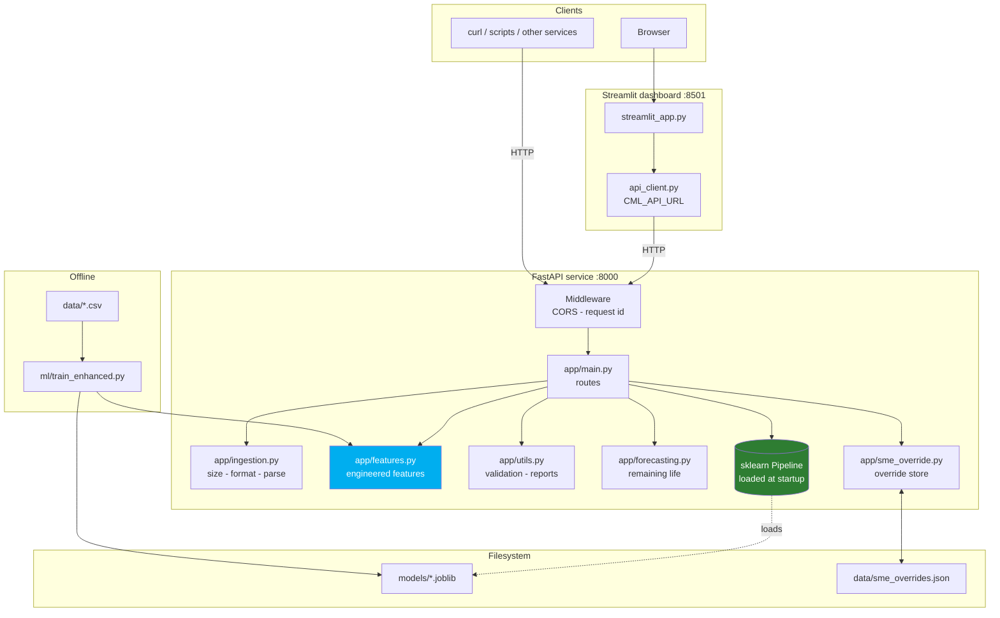
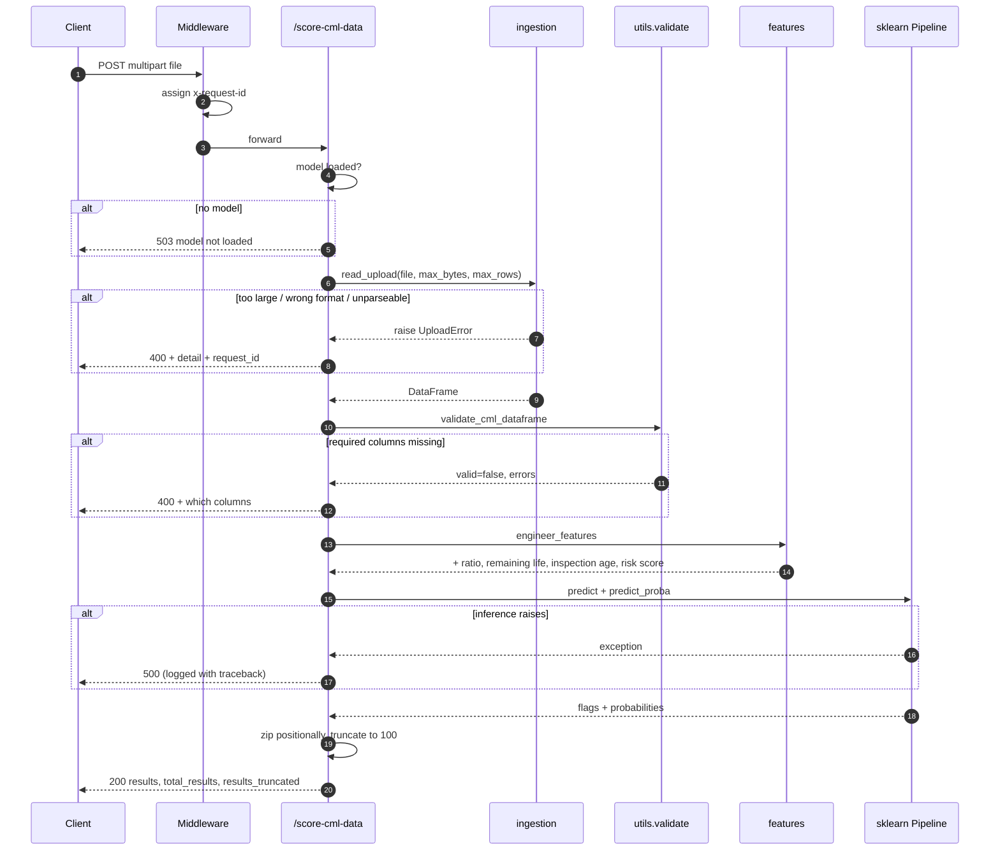
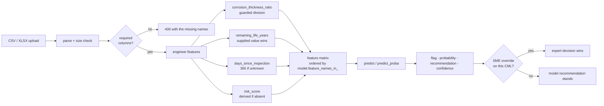
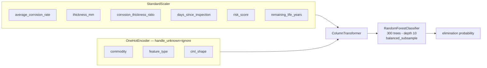
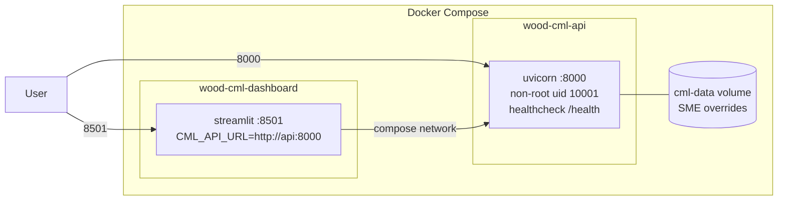

# Architecture

## System overview

Two processes: a FastAPI service that owns the model and all business logic,
and a Streamlit dashboard that talks to it over HTTP. The dashboard holds no
scoring logic of its own, so a CLI, a notebook or another front end gets the
same behaviour from the same endpoints.

`app/features.py` is deliberately shared by the API and the training script.
It is the one place the remaining-life and corrosion-ratio formulas are
defined, so training and serving cannot compute them differently — the
condition that previously caused train/serve skew (see
[ADR-0003](adr/0003-share-feature-engineering-between-training-and-serving.md)).

## Module responsibilities

| Module | Owns | Depends on |
| --- | --- | --- |
| `app/main.py` | Routes, HTTP status mapping, model lifecycle | everything below |
| `app/config.py` | Settings from env/`.env`, path resolution | — |
| `app/ingestion.py` | Upload size/format/parse; `UploadError` | pandas |
| `app/features.py` | Engineered feature columns | pandas, numpy |
| `app/utils.py` | Dataframe validation, inspection schedule, reports | pandas |
| `app/forecasting.py` | `CMLForecaster`: life, intervals, risk levels | `app.features` |
| `app/sme_override.py` | Override persistence and statistics | pandas |
| `app/advanced_analytics.py` | Plotly figures and dataset statistics | `app.features`, plotly |
| `app/schemas.py` | Request/response contracts | pydantic |

Dependencies point one way — routes depend on services, never the reverse —
so any module can be imported and tested without starting the API.

## Request lifecycle: scoring

The distinction that matters: anything the caller can fix is a `400` carrying
the reason; only a genuine server fault is a `500`. Previously every rejected
upload surfaced as a `500` because `HTTPException` was raised inside a `try`
whose own `except Exception` re-wrapped it.

## Data flow

Two columns behave the same way on purpose: `risk_score` and
`remaining_life_years` are used as supplied and only derived when absent,
because the training pipeline consumes both straight from the source file.

## Model pipeline

`handle_unknown="ignore"` means a commodity the model never saw does not
raise — it contributes nothing to the prediction. The serving code reads the
column list from `model.feature_names_in_` rather than a hardcoded list, so
retraining with a different feature set cannot silently desynchronise the API.

## Deployment topology

The dashboard waits on `service_healthy`, so it never starts against an API
that has not loaded its model. The source tree is baked into the image rather
than bind-mounted: what runs is what was built.

## Design decisions

Recorded as ADRs in [`adr/`](adr/):

| ADR | Decision |
| --- | --- |
| [0001](adr/0001-single-canonical-api-entry-point.md) | One API module, not four parallel copies |
| [0002](adr/0002-pin-dependencies-to-the-model-artifact.md) | Pin dependencies to the model artifact's scikit-learn |
| [0003](adr/0003-share-feature-engineering-between-training-and-serving.md) | Share feature engineering across training and serving |
| [0004](adr/0004-centralise-upload-validation.md) | Centralise upload validation; client errors are 400s |

## Conventions

- Type hints on public functions; `from __future__ import annotations` in new
  modules.
- Google-style docstrings stating what a function returns and what it raises.
- Comments explain *why*. A comment restating the code is noise; one recording
  a constraint that is not visible locally is the point.
- Never swallow an exception silently. Either handle it and log something
  actionable, or let it propagate.
- Configuration comes from `app.config.settings`, never from a literal at a
  call site.
- Business logic lives in `app/`, never in `streamlit_app.py`.
